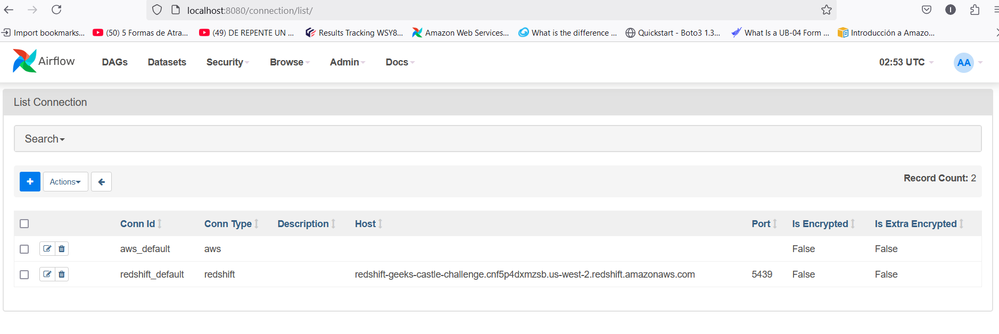

# data-process_challenge
Process a csv dataset with boto3 library and AWS services interactions

### Request:

- Upload a CSV file with dummy transaction data to S3 (the file must be
provided as part of the test).

- Process the file using a Python script:
  - Read the file from S3.
  - Filter transactions by a condition (for example, “amount > 500”).
  - Save the filtered results in Redshift.
- Upon completion of processing, send a notification via SNS indicating that the
Data was loaded successfully.

### Evaluation Criteria:

- Using appropriate libraries to work with AWS (for example, boto3).
- Implementation of efficient processing (use of pandas, parallelization if necessary)
- Adequate management of errors and logs.
- Security in data handling (without exposing credentials).

### Install and deployment description:

1. Use an Airflow docker images for deploy the pipeline. For more information [check](https://airflow.apache.org/docs/apache-airflow/stable/howto/docker-compose/index.html).

1. It is necessary a AWS user and obtain the access:  

   - AWS_SECRET_ACCES_KEY
   - AWS_ACCESS_KEY_ID
   - AWS_DEFAULT_REGION

    Get the IAM user values associated and copy in docker-compose environement variables

1. Was created a S3 bucket for same user in AWS. You must create a S3 Bucket and defined the airflow variable AWS_S3_STORE_BUCKET_NAME.

   

1. Was downloaded a [csv file from url](https://www.stats.govt.nz/assets/Uploads/Balance-of-payments/Balance-of-payments-and-international-investment-position-June-2024-quarter/Download-data/balance-of-payments-and-international-investment-position-june-2024-quarter.csv), but you can modified the url address defined the Airflow variable `EXTERNAL_URL_CSV`.   However you must modified the filter csv task named `process_and_filter_download_file_task` in dags/airflow_pipeline.py file with csv columns and filter criteria. If you modified the `EXTERNAL_URL_CSV`  another csv file or other type of data, we are not responsable of result or error. 

1. It's importan too, create a aws_default conection with your `AWS_SECRET_ACCES_KEY` and 
`AWS_ACCESS_KEY_ID` with the same user values that docker-compuse.yaml  variable values. 
For more information you can [check this information](https://airflow.apache.org/docs/apache-airflow-providers-amazon/stable/connections/aws.html). 

   

1. Docker images deployment:
   In the repository directory `airflow_aws_data_pipeline` you must execute:
      
      `docker compose up` 

   It's important check before, docker-compose.yml file present.

1. We create a RedSfhit database with a cluster configuration. In the database defined a 
table named income with the same column features than [csv file](https://www.stats.govt.nz/assets/Uploads/Balance-of-payments/Balance-of-payments-and-international-investment-position-June-2024-quarter/Download-data/balance-of-payments-and-international-investment-position-june-2024-quarter.csv).
You can get the table DDL in [table_ddl/income_table.sql](files/table_ddl.sql).  It's a requeriment the table name `income`, with public schema. 

      
1. For Airflow conection with the RedShift database you need create a **redshift_default** conection with your Redshift cluster information. For more information you cant [check this information](https://www.astronomer.io/docs/learn/airflow-redshift/). Also, you need configure the RedShift cluster database for permit external conection. For more information [check in post](https://docs.bigeye.com/docs/redshift).

1. Was created an Amazon Simple Notification Service (Amazon SNS) notificator for send email, if you want 
received notification when workflow (pipeline) finalized, contact to developer team.

    

