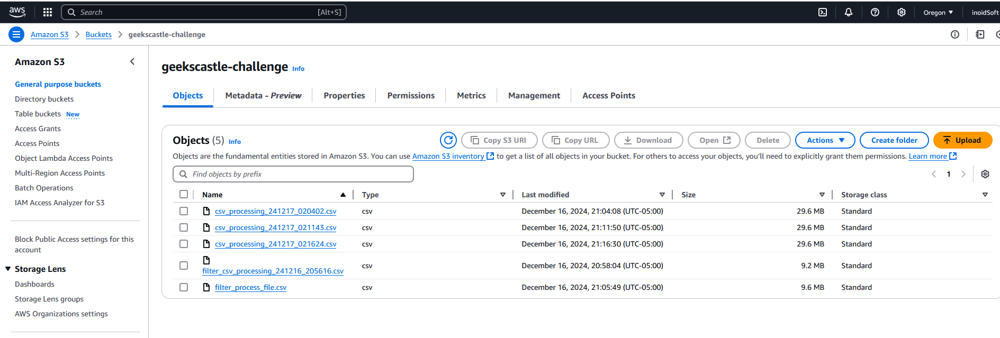
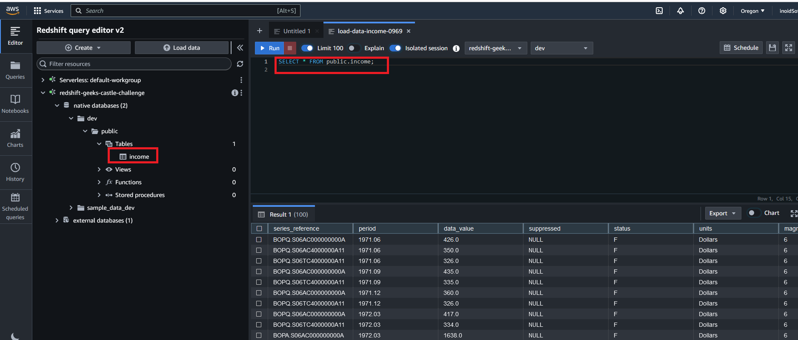
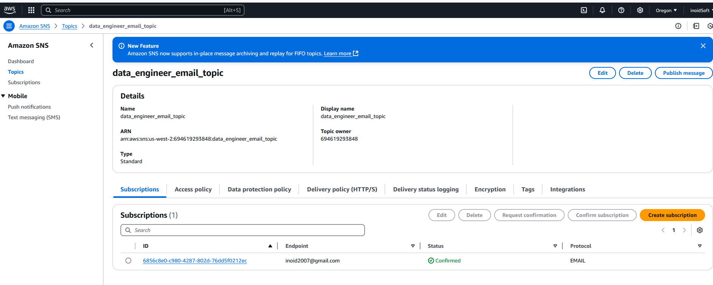

# data-process_challenge
Process a csv dataset with boto3 library and AWS services interactions

### Request:

- Upload a CSV file with dummy transaction data to S3 (the file must be
provided as part of the test).

- Process the file using a Python script:
  - Read the file from S3.
  - Filter transactions by a condition (for example, “amount > 500”).
  - Save the filtered results in Redshift.
- Upon completion of processing, send a notification via SNS indicating that the
Data was loaded successfully.

### Evaluation Criteria:

- Using appropriate libraries to work with AWS (for example, boto3).
- Implementation of efficient processing (use of pandas, parallelization if necessary)
- Adequate management of errors and logs.
- Security in data handling (without exposing credentials).

### Install and deployment description:

1. It is necessary a AWS user and obtain the access, and another important variables:  

   - REDSHIFT_WORKGROUP : Name of your workgroup in your RedShift database
   - REDSHIFT_DATABASE : Name of your database. Ex: `dev`
   - REDSHIFT_DBUSER : The access your database. Ex: `awsuseer`
   - REDSHIFT_CLUSTER_IDENTIFIER : The name of your  AWS RedShift database cluster.
   - TABLE_NAME: Name of table. Ex: `public.income`. Note the `public` schema in name
   - REDSHIFT_REGION_CLUSTER: The RedShift database region.
   - ARN_SNS_URL_IN_AWS:  Your arn topic notifier. Ex: `arn:aws:sns:us-east-2:694619293848:data_engineer_email_topic`
   - AWS_BUCKET_NAME: S3 bucket name.
   
1. In (**data-process_challenge**) directory, create another named `config`, inner create and edit a file named `.env` 
   with environment variables defined above, with your data. It's important for process data pipeline 
   successful execution (e.d wrong data avoid AWS service use).
1. To use AWS access key and configuration file associated install `aws cli` and with command `aws configure` add in your
   environment the AWS access key.
1. Create a python environment, activate it and execute inner **data-process_challenge** the command:
    - `pip install -r requierements.txt`
1. In data-process_challenge there are important files:
   - config: Directory with important environment variables for connecting to AWS services, edited in .env file.
   - datasets: Directory where *.csv file will be download and modified in data process. Please not rename or erase this directory.
   - doc: Directory with images and document about process.
   - main.py: The file with all code source for pipeline process data.
   - requirements.txt: The file with all python dependencies modules.
1. If you edit all environment variables with correct data, and register your user access key in the system, then execute inner directory
    **data-process_challenge**:
   - `python main.py`
1. Was created a S3 bucket for same user in AWS. You must create a S3 Bucket and defined, in file `config/.env`
   to variable AWS_S3_STORE_BUCKET_NAME.

   

1. Was downloaded a [csv file from url](https://www.stats.govt.nz/assets/Uploads/Balance-of-payments/Balance-of-payments-and-international-investment-position-June-2024-quarter/Download-data/balance-of-payments-and-international-investment-position-june-2024-quarter.csv), but you can modify the url address defined in `main.py` file change
   `EXTERNAL_URL_CSV` variable value.  However, you must modify the class S3AWS and method `` 
   with your correct filter criteria. If you modified the `EXTERNAL_URL_CSV` with another csv file or other type of data,
   we are not responsible about final result or error. 

1. We create a RedSfhit database with a cluster configuration. In the database defined a 
   table named income with the same column features than [csv file](https://www.stats.govt.nz/assets/Uploads/Balance-of-payments/Balance-of-payments-and-international-investment-position-June-2024-quarter/Download-data/balance-of-payments-and-international-investment-position-june-2024-quarter.csv).
   You can get the table DDL in [doc/table_ddl/income_table.sql](doc/table_ddl/icome_table.sql). 
   It's a requirement the table name `income`, with public schema. 

      

1. Was created an Amazon Simple Notification Service (Amazon SNS) notificator for send email, if you want 
received notification when workflow (pipeline) finalized, contact to developer team.

    

