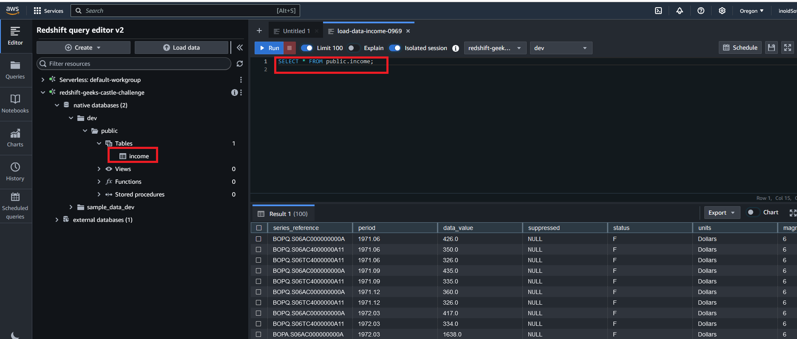
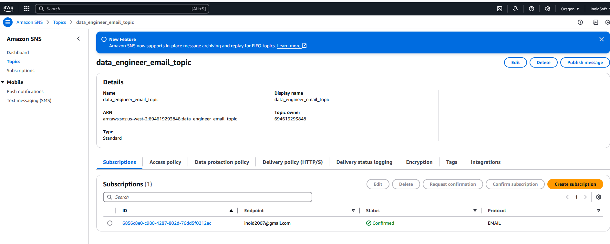

# data-process_challenge
Process a csv dataset with boto3 library and AWS services interactions

### Request:

- Upload a CSV file with dummy transaction data to S3 (the file must be
provided as part of the test).

- Process the file using a Python script:
  - Read the file from S3.
  - Filter transactions by a condition (for example, “amount > 500”).
  - Save the filtered results in Redshift.
- Upon completion of processing, send a notification via SNS indicating that the
Data was loaded successfully.

### Evaluation Criteria:

- Using appropriate libraries to work with AWS (for example, boto3).
- Implementation of efficient processing (use of pandas, parallelization if necessary)
- Adequate management of errors and logs.
- Security in data handling (without exposing credentials).

### Install and deployment description:

1. Es necesario un usuario AWS y obtener las claves de acceso a los servicios, y otras variables importantes:  

   - REDSHIFT_WORKGROUP : Nombre de su grupo de trabajo en la base de datos RedShift
   - REDSHIFT_DATABASE : Nombre de su base de datos. Ej: `dev`
   - REDSHIFT_DBUSER :  Usuario de acceso a la base de datos. Ex: `awsuseer`
   - REDSHIFT_CLUSTER_IDENTIFIER : El nombre de su cluster en la base de datos RedSfhift 
   - TABLE_NAME: Nombre de la tabla Ex: `public.income`. Notese el nombre del esquema  `public` en el nombre.
   - REDSHIFT_REGION_CLUSTER: La región donde fue creada la base de datos RedShift.
   - ARN_SNS_URL_IN_AWS: El arn de su tópico notificador. Ej: `arn:aws:sns:us-east-2:694619293848:data_engineer_email_topic`
   - AWS_BUCKET_NAME: Nombre del bucket en S3.
   
1. En este directorio (**data-process_challenge**), cree otro de nombre `config` y dentro  de este un archivo nombrado `.env`. 
    Edite en el las variables definidas anteriormente con los datos correctos. Esto es importante porque de no realizarse 
    correctamente los diferentes pasos del procesamiento no se conectará con los servicios de AWS.
1. Para la creación de los archivos de configuración y el uso de las claves de acceso de su usuario a AWS  instale `aws cli` y con el comando `aws configure` registre en su ambiente las claves de acceso.
1. Cree un ambiente de python para instalar las dependencias, active este y ejecute dentro del directorio **data-process_challenge** el comando:
     `pip install -r requierements.txt`
1. En este directorio **data-process_challenge**  hay importantes archivos:
   - **config**: Directorio con la definición de importantes variables de ambiente para conectarse a servicios de AWS, editados en el archivo **.env**.
   - datasets: Directorio donde los archivos  *.csv se descargarán y modificarán durante el procesamiento de los datos. 
     Por favor no renombre o borre este directorio.
   - doc: Directorio con imágenes y documentos sobre este proyecto.
   - main.py: El archivo con todo el código fuente para el flujo de trabajo del procesamiento de los datos.
   - requirements.txt: El archivo con los módulos de python de los que depende este proyecto.
1. Si usted edita todas las variables de ambiente con los datos correctos, y registra correctamente las claves de acceso de su usuario a AWS, entonces 
dentro del directorio **data-process_challenge** ejecute el comando:
   - `python main.py`
1. Para este proyecto fue creado un bucket en S3 para el mismo usuario. Se debe crear un bucket S3 y definir su nombre en el archivo `main.py` en 
   la variable AWS_S3_STORE_BUCKET_NAME.
   

1. Se utilizó [un archivo csv de la url](https://www.stats.govt.nz/assets/Uploads/Balance-of-payments/Balance-of-payments-and-international-investment-position-June-2024-quarter/Download-data/balance-of-payments-and-international-investment-position-june-2024-quarter.csv),  pero se puede modificar esta dirección definiendo en el archivo `main.py` 
un nuevo valor para la variable `EXTERNAL_URL_CSV`. Sin embargo, se debe modificar los filtros del archivo csv 
en la clase S3AWS (ver código fuente en `main.py`) en la función ``. Si usted modifica la variable `EXTERNAL_URL_CSV` 
con otro archivo csv u otro tipo de archivo, no somos resposables del resultado o error. 

1. Se creó una base de datos RedSfhit con una configuración de cluster. En la base de datos se creó una tabla 
nombrada `income` con las mismas columnas que aparecen en el [archivo csv ](https://www.stats.govt.nz/assets/Uploads/Balance-of-payments/Balance-of-payments-and-international-investment-position-June-2024-quarter/Download-data/balance-of-payments-and-international-investment-position-june-2024-quarter.csv). Se puede obtener el DDL de 
la tabla en el directorio [table_ddl](doc/table_ddl/icome_table.sql). Es un requerimiento el nombre de
la tabla `income`, con un esquema público.
      

1.  Fue creado un notificador de tipo Servicio de Notificación Simple de Amazon 
(Amazon Simple Notification Service; Amazon SNS) para el envío de notificaciones por correo electrónico cuando
el flujo de trabajo finaliza, contacte al equipo de desarrollo para recibir las notificaciones.

    

